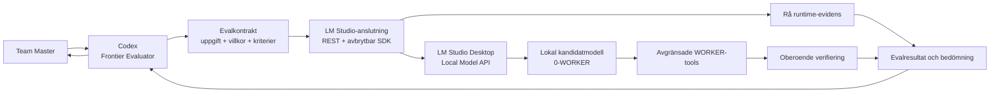

# Current Architectural Project State

**Statusdatum:** 2026-09-14
**Dokumentets ansvar:** Ge en extern agent en självständig och arkitekturnära förståelse av projektets långsiktiga syfte, huvudkomponenter, teknikval, ansvarsfördelning och centrala runtimeflöden.

## 1. Projektets kärna

Projektet bygger en professionellt spårbar miljö där en stark Frontier-modell utvärderar lokala språkmodeller som möjliga framtida agenter åt Team Master.

Det yttersta målet är inte vanlig chatt eller en samling modellbenchmarks. Målet är att utveckla, pröva och förstå lokala modeller som kan utföra verkligt agentarbete: tolka instruktioner, använda uttryckligt tilldelade verktyg, läsa och skriva inom avgränsat scope, verifiera resultat och fungera tillförlitligt i ett framtida agentteam.

Den enda aktiva agentrollen är för närvarande **0-WORKER**. Dess absolut viktigaste och primära slutmål är professionellt, precist, välstrukturerat och verifierbart arbete med de centrala kod- och filytorna i `comfy_ui_workspace`, framför allt ComfyUI workflow-JSON och berörd projektlokal backend-/integrationskod. Generell instruktion-, fil- och toolförmåga är kvalificeringsgrund för detta huvudmål. Andra rollmappar är utanför aktivt scope tills Team Master uttryckligen ändrar riktningen.

## 2. Styrande arkitektur

- **Codex är Frontier-as-Evaluator med prioritet 1.** Codex äger evaldesign, orkestrering, övervakning, avbrott, verifiering och felklassificering.
- **Den lokala modellen är systemet under test.** Den får endast tillgodoräknas arbete som den själv utför under dokumenterade villkor.
- **LM Studio är projektets enda aktiva lokala modell-harness.** Det är den gemensamma runtimeytan genom vilken Frontier-evaluatorn kommunicerar med lokala kandidater.
- **Native LM Studio REST API v1 är primär transport.** LM Studios officiella JavaScript-SDK används endast där strömmad, begäransspecifik och verifierbar avbrottsförmåga krävs.
- **Bionic är legacy/deprecated.** Det får inte äga aktiv transport, session, logging, evalgate eller ny plattformsarkitektur.
- **Evidens ska vara revisionsbar.** LM Studios interna tillstånd eller kandidatens egna påståenden ersätter aldrig projektägda artefakter och oberoende verifiering.
- **Modell-, plattforms- och evaldesignproblem hålls isär.** Gemensam korrelation är tillåten; sammanblandat orsaksspråk är det inte.

## 3. Arkitekturen i ett flöde

Flödet är medvetet evaluatorstyrt. Kandidaten får instruktionen och tillgängliga verktyg, men evaluatorn behåller kontroll över scope, stopp, evidens och slutlig bedömning.

## 4. Top-level-mappar och ansvar

| Yta                      | Permanent huvudansvar                                                                                                | Ska inte äga                                                       |
| ------------------------ | -------------------------------------------------------------------------------------------------------------------- | ------------------------------------------------------------------ |
| `docs/`                  | Styrande beslut, plattformsdokumentation, roadmappar, handoffregler och referensmaterial                             | Runtimekod, evalresultat eller genererade loggar                   |
| `LM-Studio_connections/` | Transport, auth-anpassning, avbrytbar inferens, modellinventering och LM Studio-observability                        | Kandidatspecifik bedömning eller rollsemantik                      |
| `LM-Studio_logs/`        | Evaluation-oberoende rå evidens från LM Studio, modellivscykel och värdsystem                                        | PASS/FAIL, evalrubrics eller duplicerade evalartefakter            |
| `runtime_logging/`       | Gemensamma primitives för bounded operationsdokument, sanering, atomisk persistens och retention                    | Plattformshändelser, profilorkestrering eller en central collector |
| `logs/`                  | Komponentägda, evaluation-oberoende runtimecaptures för icke-LM-producenter                                          | Evalresultat, genererade mediafiler eller generell fellogg         |
| `LOCAL_AGENTS/`          | Modellneutrala roller, gemensam kontext, WORKER-tools, rollspecifika evalresurser och kandidatspecifik konfiguration | Generella LM Studio-loggar eller Frontierns slutbedömning          |
| `model_evaluations/`     | Gemensam evalarkitektur samt ett separat artefakthem per faktisk evalkörning                                         | Generell serverlogging eller produktionskonfiguration för modellen |
| `tests/`                 | Automatiska kontrakts-, regressions- och kontrolltester för harness, tools och evalkomponenter                       | Manuella resultat eller kosmetiska tester utan beteendesignal      |
| `tools/`                 | Smala operatörs- och utvecklarverktyg, exempelvis diagnostik, tokenupplösning och rollpaths                          | Permanent agentpolicy eller evalresultat                           |
| `scripts/`               | Projektövergripande drift- och integrationsskript, främst avgränsad GitHub-synk                                      | Modellsemantik, graders eller LM Studio-transport                  |

## 5. Centrala komponenter

### `docs/`

Denna yta beskriver varför arkitekturen ser ut som den gör och vilka beslut som styr den.

- `docs_plan/` innehåller frysta beslut, plattformsval och operativa roadmappar.
- `docs_lm-studio/` beskriver LM Studio API, appinställningar, stateful chat och MCP-stöd.
- `docs_handoffs_to_ChatGPT/` äger den avgränsade processen för arbete som faktiskt kan överlåtas till ChatGPT.
- `docs_cheatsheets/` innehåller korta operativa referenser.

Roadmappar är exekveringsordning, inte arkitektonisk sanning. Frysta beslut och ansvarskontrakt väger tyngre.

### `LM-Studio_connections/`

Detta är integrationslagret mellan Codex och LM Studio.

`LM-Studio_for_codex/` innehåller två kompletterande transportytor:

1. **Native REST v1** för modellinventering, vanliga anrop och generell observability. Basadressen är `http://127.0.0.1:1234`, och servern kräver Bearer-token.
2. **Officiell JavaScript-SDK** för avbrytbar evalgenerering. SDK:n äger modellströmmen och det slutliga stoppkvittot; en liten Python-controller äger bounded kontrollflöde, JSON-line IPC och processstädning.

SDK-användningen är ett avgränsat transportundantag inom samma LM Studio-harness, inte en parallell plattform. Normal avbrytning får inte unload/reload:a modellen eller döda delade LM Studio-processer.

`LM-Studio_observability/` samlar bounded, evaluation-oberoende evidens från LM Studio CLI, REST och värdsystemet. Den startar inte modeller och ska inte bli en permanent tung watcher.

### `LM-Studio_logs/`

Loggroten är modulär: en separat ström per verkligt ansvar.

- `server_events/` — generiska LM Studio-serverhändelser.
- `model_lifecycle_events/` — modellinventering samt load/unload-förändringar.
- `model_io_events/` — explicit opt-in för känslig modell-I/O.
- `host_resource_snapshots/` — bounded CPU-, RAM-, process- och GPU-relaterade ögonblicksbilder.

Varje capture är en självständig, indenterad JSON-fil med tidsgränser, metadata, eventuella fel och kända evidensluckor. Tokens ska aldrig loggas. Onödiga absoluta sökvägar och duplicerade manifest undviks.

### `runtime_logging/` och `logs/`

Plan 9 steg 2–7 har etablerat och lokalt offlineverifierat den gemensamma kärnan och ägargränsen. `runtime_logging/` centraliserar bounded operationsdokument, schema-/policyvalidering, sanering, atomisk persistens, retentionplanering och operator-CLI; LM Studio behåller sitt plattformsformat genom en tunn adapter i stället för en duplicerad algoritmisk implementation.

`logs/` är en rot, inte en generell loggägare. Rå captures delas efter faktisk producent, exempelvis SillyTavern, KoboldCpp, Dia2, Diffusers, host, AutoPull och framtida profilorkestrering. Varje fel stannar i ägarströmmen och tvärkomponentoperationer länkas med korrelation och referenser. Evalresultat, Story Creator-runloggar, `LM-Studio_logs/` och media-/storyartefakter ligger kvar hos sina befintliga ägare.

### `LOCAL_AGENTS/`

Detta är agentdomänens ägaryta.

- `ROLE-NEUTRAL-CONTEXT/` äger kontext som kan återanvändas mellan flera framtida agentroller.
- `AGPR-0-CODER/` äger all modellneutral men WORKER-specifik struktur: rollkontext, toolkontrakt, evalkataloger och graders.
- En modellundermapp under rollen äger endast kandidatens fakta, effektiva konfiguration, chat template och uttryckligt motiverade avvikelser.

Gemensamma WORKER-kontrakt får inte kopieras in i varje modellmapp. Kandidatmappar är utbytbara implementationer under samma roll, inte nya roller.

Aktuella WORKER-tools följer explicit scope och processägarskap. Ett verktyg måste faktiskt ha körts och dess effekt måste verifieras; en modell som endast skriver ett tool call som text har inte utfört verktyget.

### `model_evaluations/`

Detta är den evalspecifika ägarytan.

- Den gemensamma arkitekturfilen definierar modellneutral Frontier-as-Evaluator-design.
- Varje evalkörning får exakt ett eget hem direkt under `model_evaluations/`.
- Ett evalhem innehåller rå körningsevidens, kontrollerade villkor, graders/resultat och en sammanfattande rapport när körningen är slutförd.

En extra generell `frontier_evaluations/`-wrapper används inte. Evalspecifik evidens hör direkt till sitt evalhem; evaluation-oberoende driftloggar stannar i `LM-Studio_logs/`.

## 6. EVAL-design i korthet

En eval är ett kontrollerat experiment för verkligt WORKER-arbete, inte en fri chatt och inte en jakt på godkända svar.

1. **Lås evalkontraktet:** kandidat och modellinstans, kvantisering, effektiv template, sampling, kontext, tools, scope, instruktion och endast de kriterier som påverkar korrekt utförande.
2. **Gör preflight:** verifiera auth, server, laddad modell, verktygsförutsättningar, destination och avbrottskontroll utan att implicit starta obegränsad last.
3. **Kör ett bounded försök:** färsk dokumenterad konversation, löpande evidens och ingen tyst ändring av villkor mitt i försöket.
4. **Behåll evaluatorn In-The-Loop:** Codex kan inspektera pågående arbete och avbryta vid konkret säkerhets-, budget-, no-progress-, harness- eller evaldesignskäl.
5. **Verifiera effekten oberoende:** disk-, API-, process- och tool-evidens väger tyngre än kandidatens beskrivning av vad den gjorde.
6. **Bedöm först uppgiften:** klarade kandidaten uppgiften? Därefter: vilket värde har utfallet för verklig framtida 0-WORKER-användning?
7. **Klassificera rätt lager:** modell, modellspecifik konfiguration, modellneutral runtime/tooling, uppgiftsdesign/fixture/grader eller ännu obevisad orsak.
8. **Bevara originalet:** en korrigering skapar ett nytt länkat och versionerat försök. Coaching redovisas som assisterad diagnostik, inte baseline-framgång.

PASS/FAIL får inte styras av kosmetik eller kriterier som evaluatorn hittar på efteråt. Ett dåligt resultat ska först utredas genom effektiv modellkonfiguration, modellneutral runtime/tools och uppgiftens tydlighet innan en modellbegränsning fastslås.

Första screening kan vara verktygsfri och minimalt konditionerad för att mäta instruktionsefterlevnad utan tung rollinjektion. Det bevisar endast de testade uppgiftsutfallen. Fil-, tool- och mutationsförmåga måste utvärderas separat under verifierade runtime- och scopevillkor.

Trajectoryn börjar därför med teknologioberoende instruktion-, fil- och tooluppgifter. Den senare halvan prövar ComfyUI-domän- och skillanvändning följt av held-out workflow-roadmaps som avgör om agentinstallationen är användbar i Team Masters dagliga arbete. `model_evaluations/comfy_ui_eval-playground/workflows/` är endast disponibelt fixturematerial: framtida ERST arbetar i unika kopior och får kreativt mutera noder/länkar utan att ändra produktionsworkflows, ladda ComfyUI-modeller eller starta generering.

Full ComfyUI-kontext behöver inte färdigställas före nästa teknologioberoende eval. Före första ComfyUI-ERST krävs ett litet modellneutralt och versions-/hashbundet paket med relevant workflowformat, lokala regler, berörda nodkontrakt och statisk verifieringsprocedur. Granite får samma semantiska kontext som andra kandidater; modellspecifik presentation införs endast när reproducerbar evidens motiverar den och redovisas då separat.

## 7. Avbrotts- och processarkitektur

Avbrottsförmåga är en verifierad kontrollkedja, inte bara en timeout:

- Evaluatorn begär cancel för den ägda modellgenereringen.
- SDK-strömmen konsumeras tills LM Studio lämnar ett slutligt stoppresultat.
- Berörda projektägda toolprocesser stoppas via Windows Job Object och kontrolleras separat.
- Partiell output, stoppskäl, tidsstämplar och kvarstående processstatus sparas.

Att klienten stänger anslutningen, att en timeout löper ut eller att terminalen återkommer är inte ensamt stoppbevis. Delade LM Studio-processer och andra klienters arbete ska lämnas orörda.

## 8. Teknikstack

| Teknik                                 | Roll i projektet                                                 |
| -------------------------------------- | ---------------------------------------------------------------- |
| Windows                                | Primär lokal runtime och processmiljö                            |
| LM Studio Desktop 0.4.x                | Modellserver, modellinstanser och Local Model API                |
| LM Studio native REST API v1           | Primär modellinventering, chat och observability                 |
| `@lmstudio/sdk` 1.5.x                  | Strömmad och begäransspecifikt avbrytbar evalgenerering          |
| Node.js / ESM                          | SDK-adapter, tool-bridge och Node-baserade tester                |
| Python 3.11                            | Evalcontroller, graders, filtools och observability-skript       |
| PowerShell                             | Windows-orienterade smoke- och operatörsskript                   |
| JSON / JSON-line IPC                   | Maskinläsbara kontrakt, events och processtyrning                |
| Markdown                               | Beslut, design, runbooks och mänskligt granskningsbara rapporter |
| Jinja chat templates                   | Modellens effektiva meddelandeformatering                        |
| GGUF                                   | Lokalt modellformat                                              |
| Python `unittest` och Node `node:test` | Kontrakts- och regressionstestning                               |
| Git och GitHub                         | Versionskontroll samt kontrollerad extern handoffkanal           |

Den aktiva SDK-transporten har en tidsbegränsad auth-anpassning för LM Studios tokenmappning. Giltig token måste accepteras, ogiltig token nekas och anonym fallback är förbjuden. Anpassningen ska tas bort när den publicerade SDK:n har direkt stöd för samma kontrakt.

## 9. Evidens- och felägarskap

| Fråga                                                                | Rätt ägare                             |
| -------------------------------------------------------------------- | -------------------------------------- |
| Vad skickade och returnerade modellen under låsta villkor?           | Kandidatens run-evidens i evalhemmet   |
| Dispatchade LM Studio/SDK:n ett strukturerat tool call?              | LM Studio-/anslutningsevidens          |
| Kördes verktyget och vilken effekt fick det?                         | Tool-/process- och verifieringsevidens |
| Klarades uppgiften och är resultatet användbart för WORKER-rollen?   | Evalresultat och rapport               |
| Vad gjorde LM Studio eller dess observerade värdsystem oberoende av evalen? | Separat ström i `LM-Studio_logs/`      |
| Vad gjorde en icke-LM runtimekomponent oberoende av evalen?         | Komponentens ägarström under `logs/`   |

Samma korrelations-ID kan länka lager. Rå data ska länkas, inte kopieras mellan ägare. Om evidensen inte visar orsaken ska orsaken förbli uttryckligen obevisad.

PASS/FAIL anger först om uppgiften klarades och är inte automatiskt en modellspecifik orsaksbedömning. Modellens prestationssammanfattning får endast tillskriva positiv förmåga under verifierade, exakt avgränsade villkor och negativa egenskaper när modellen har isolerats som ensam felägare. Alla oklara eller delade orsaker dokumenteras hos rätt harness-, runtime-, evaldesign-, evaluator- eller projektägare och hålls utanför modellspecifik bedömning.

## 10. Säkerhets- och resursgränser

- Ingen runner får implicit ladda en modell eller starta obegränsade inferensloopar.
- En konkret bounded eval ger evaluatorn mandat att ladda och vid behov avlasta den valda modellen.
- Lokala verktyg ska använda minsta nödvändiga filscope och kontrollera path traversal och symlänkar.
- Windows Job Object ger processkontroll för projektägda barnprocesser men är inte ett fullständigt OS-sandboxskydd.
- Känslig modell-I/O fångas endast explicit och bounded.
- Token, hemligheter och onödiga absoluta användarsökvägar får inte skrivas till artefakter.
- CPU-, RAM-, disk- och GPU-last ska hållas kontrollerad; tung eller långvarig last är inte ett normalt bakgrundsbeteende.

## 11. Nuvarande mognadsgräns

Den centrala arkitekturen för LM Studio-anslutning, modulär observability, evalartefakter, avbrytbar generering, kontrollerad filinspektion och separat felägarskap finns etablerad. Plan 9:s gemensamma kärna, AutoPull-/hostadapter, SillyTavern-/KoboldCpp-instrumentering och offlinegates är implementerade; verkliga Windows-/runtimegates, Dia2/SANA-slices och slutlig prestanda-/retentionpromotion återstår i steg 8–11.

Följande ska inte antas vara generell färdig kapacitet:

- Textuellt formulerade tool calls är inte automatiskt native tool dispatch.
- Modellspecifika tool-envelope-adaptrar är diagnostiska kompatibilitetslager, inte modellneutral framgång.
- Full read/write-WORKER-förmåga är inte bevisad bara för att läsning eller verktygsfri instruktionsefterlevnad fungerar.
- Windows-jobb ger verifierad kontroll av ägda validatorprocesser och den aktuella filrunnern har en effektbaserad no-progress-watchdog; detta är fortfarande inte komplett OS-isolering eller en generell garanti för externa MCP-processer.
- Käll- och testpaths måste vara bundna till den aktuella projekttoppen innan nästa eval får betraktas som reproducerbar efter en projektflytt.

Arkitekturens avsikt är därför kontrollerad progression: minsta verklighetsnära uppgift, oberoende verifikation, bevarad evidens och nästa kapacitetsökning först när föregående lager är tillräckligt försvarbart.

## 12. Extern samverkan och Git

ChatGPT-handoffs används endast för substantiellt arbete som den externa agenten faktiskt kan utföra med tillgänglig repoåtkomst och tydliga acceptanskriterier. Lokal LM Studio-, modell-, process- eller Windows-åtkomst får aldrig antas följa med en GitHub-handoff.

Handoffdokument har en enda ägare i `docs/docs_handoffs_to_ChatGPT/`. Projektets GitHub AutoPull-skript kan hämta avgränsade resultat när fast-forward och lokal arbetsyta tillåter det. Genererade caches, beroenden, virtuella miljöer och generiska runtimecaptures hålls borta från Git genom `.gitignore`; evalbevis, källkod, tester och styrande dokument ska däremot kunna versionshanteras.

## 13. Rekommenderad läsordning

En extern agent som behöver gå från översikt till källsanning bör läsa:

1. [Final Platform Decision](<docs/docs_plan/FINAL PLATFORM DECISION - CONCLUSIONS.md>)
2. [Project Direction and Frozen Decisions](<docs/docs_plan/[PLAN] - [PROJECT DIRECTION & PURPOSE] - [FRYSTA BESLUT].md>)
3. [Frontier-as-Evaluator Design](<model_evaluations/[EVAL] - [ARCH.] - [Frontier-As-Evaluator] - [Design].md>)
4. [LM Studio Connection Contract](LM-Studio_connections/LM-Studio_for_codex/README.md)
5. [LM Studio Observability Contract](LM-Studio_connections/LM-Studio_observability/README.md)
6. [LM Studio Log Ownership](LM-Studio_logs/README.md)
7. [0-WORKER Evaluation Surface](LOCAL_AGENTS/AGPR-0-CODER/agent-0-eval/README.md)
8. [ChatGPT Handoff Rules](docs/docs_handoffs_to_ChatGPT/handoff_instructions_and_rules.md)
9. [Local Runtime Observability Decisions](<docs/docs_plan/[PLAN] - [9] - [LOCAL RUNTIME OBSERVABILITY] - [FRYSTA BESLUT].md>)
10. [Local Runtime Observability Roadmap](<docs/docs_plan/[PLAN] - [9] - [LOCAL RUNTIME OBSERVABILITY] - [ROADMAP].md>)

Denna fil är en orienteringskarta. Vid konflikt gäller nyare frysta beslut och verifierad runtime-evidens framför sammanfattningar, äldre roadmaptext eller modellens/evaluatorns egna obevisade påståenden.
